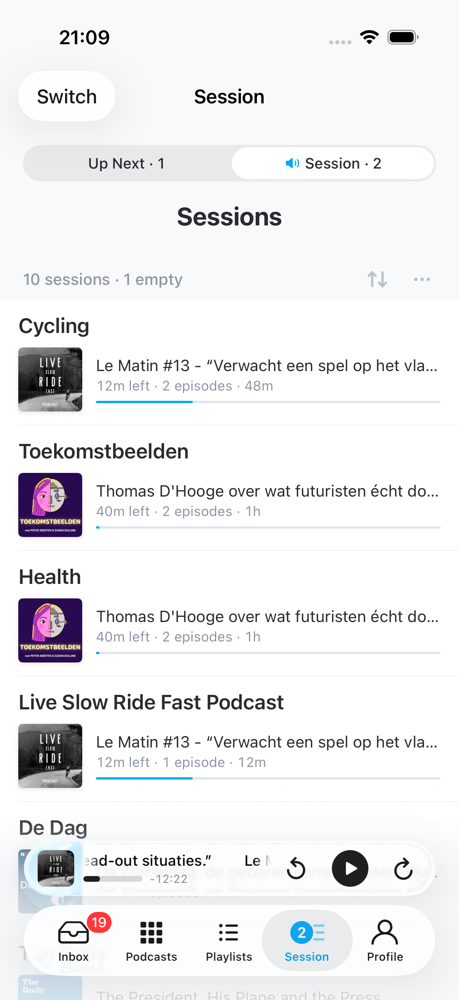
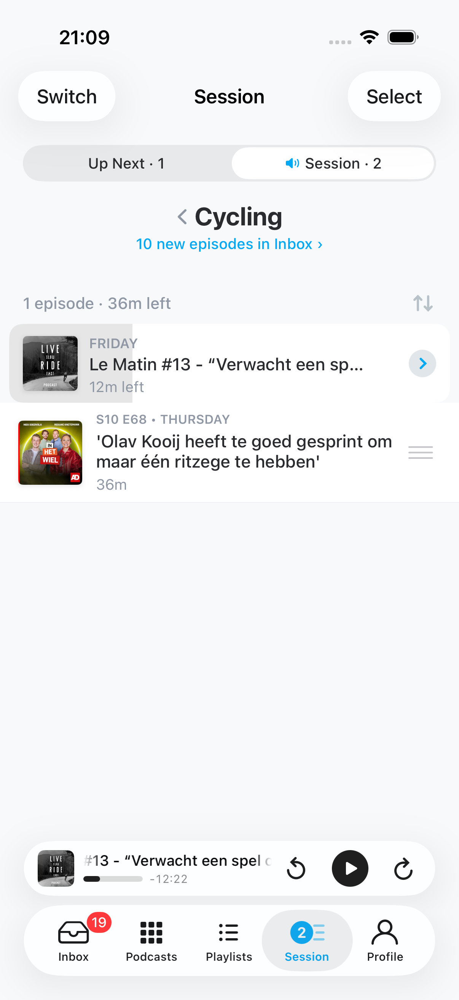
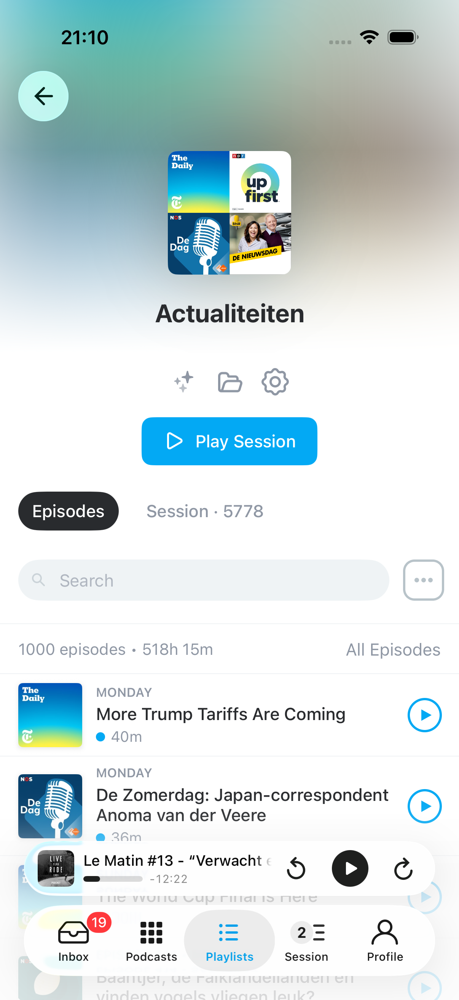
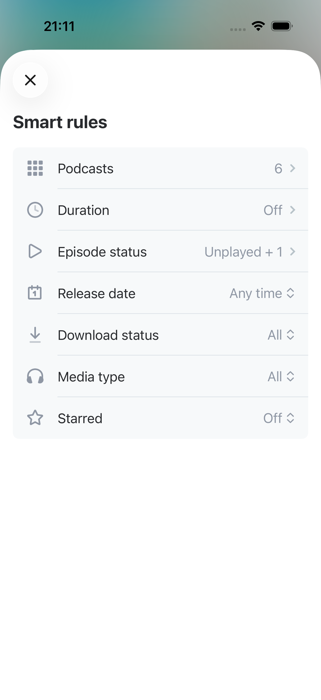

<p align="center">
    <!-- Pocket Casts brand image -->
    
    
</p>

<p align="center">
    <!-- Badge: "build: {trunk CI status}" -->
    <a href="https://buildkite.com/automattic/pocket-casts-ios"></a>
    <!-- Badge: "license: MPL" -->
    <a href="https://github.com/Automattic/pocket-casts-ios/blob/trunk/LICENSE.md"></a>
    <!-- Badge: "platform: ios|watchos" -->
    
    <!-- Badge: "Xcode: {version}+" -->
    
</p>

<p align="center">
    Pocket Casts is the world's most powerful podcast platform, an app by listeners, for listeners.
</p>

# 🍴 About this fork

A personal fork by [@mdbraber](https://github.com/mdbraber) on the `feature/session` branch. It adds a
listening workflow on top of Pocket Casts: episodes arrive in an **Inbox** to be triaged, get shelved into
**Sessions** — curated lineups you play *beside* the Up Next queue — and are found again through named
**Filter Presets**. Fork state that has nowhere to live upstream (session lineups, the seen-ledger,
preferences) syncs privately between the author's own devices via CloudKit; nothing fork-specific is ever
sent to Pocket Casts' servers.

<table>
  <tr>
    <td align="center"><br /><sub>Session chooser</sub></td>
    <td align="center"><br /><sub>A session's lineup</sub></td>
    <td align="center"><br /><sub>Playlist as a session</sub></td>
    <td align="center"><br /><sub>Smart rules</sub></td>
  </tr>
</table>

### Inbox

- A tab of its own: every new episode from a subscribed podcast lands here to be triaged. **Membership *is*
  the unseen state** — the Inbox is a synced manual playlist, so there is no separate "seen" column, and the
  unread dot on an episode row anywhere in the app means "still in the Inbox".
- Episodes leave when you decide something: play it, archive it, queue it, add it to a session, or clear it
  explicitly. A watermark per podcast means a fresh install or a full sync never floods the Inbox with a
  backlog.
- Decisions are recorded in a **synced seen-ledger**, so an episode you triaged on one device cannot be
  resurrected by another device's older view of the playlist.
- Group by release date, podcast, folder, duration and more; one-tap *Clear Inbox*, with Archive All behind
  a long press.

### Sessions

- A **session** is a lineup you play off to the side of Up Next — one per podcast, playlist or folder, or
  hand-made. Starting one leaves the queue untouched; when the lineup runs dry, playback returns to it.
- The Up Next tab has two worlds behind a pill switcher (**Up Next** and **Session**), with the world that
  owns playback marked. The Session side is two levels: a **chooser** listing your sessions — each row
  showing the episode it would actually play next, its duration and progress — and the **lineup** you reach
  by tapping one. Opening a session is navigation only: nothing plays until you play it.
- The chooser sorts by Recently Played (sessions you're mid-episode in first), Name, Time Left or Recently
  Updated, and can hide empty or unplayed sessions and filter by type.
- Episodes you add by hand are **pinned**: the reconciler may prune what it gathered, but never what you
  put there. Smart-playlist sessions can be set to **Fill Session: Automatic** (mirrors the playlist) or
  **Manual** (hand-curated), and any smart playlist can opt out of being a session entirely.

### Filter Presets

- Named, reorderable, synced filters — status, list membership, playing and download state, media type,
  release window, duration, podcast/folder scope, plus the sort and grouping to apply. One labelled control
  on every episode list replaces the stock funnel.

### Everywhere else

- **Swipes** speak one vocabulary: left is *Add to Session* and *Add to…* (Up Next top/bottom, or a
  playlist), with *Move to top* / *Move to bottom* added in queue contexts. Right keeps the stock
  remove/archive verbs.
- **Playlist folders** group playlists the way podcast folders group podcasts.
- **Badges** can count Inbox or session membership, on podcasts, playlists and the app icon.
- **CarPlay** puts Up Next and every session on one tab, ordered by recency and honoring the phone's filters.
- **Per-podcast settings** are grouped as Inbox → Up Next → Session, with linking overrides on their own page.

Built for personal use, so the fork favours a coherent workflow over configurability. The upstream README
follows.

## Setup

If you don't already have it, you need to install Bundler:

`gem install bundler`

Next you'll need to install all the dependencies needed for [_fastlane_](https://docs.fastlane.tools/) using this script:

`make install_dependencies`

## External contributors

If you're an external contributor run `make external_contributor`. After that you should be able to build and run the project.

## Swift Formatting

We use [SwiftLint](https://github.com/realm/SwiftLint) to ensure code is spaced and formatted the same way and follows the same [general conventions](https://github.com/Automattic/swiftlint-config). We have a script that will run it over the whole project.

Once the required dependencies are installed via `bundle exec pod install`, you can run:

`make format`

You should do this before making a pull request.

## Running

Open the `.xcodeproj` file, select the Pocket Casts project and the Simulator Device you want to run on, and hit the play button.

## Localization

You can learn more about localization at [docs/Localization.md](./docs/localization.md)

## Protocol Buffers

The app uses [Google Protocol Buffers](https://developers.google.com/protocol-buffers) to define our server objects.

To update server objects you'll need to install the protobuf command line tool as well as the [Swift Protobuf](https://github.com/apple/swift-protobuf) translators. This can be done via Homebrew with:

```
brew install protobuf
brew install swift-protobuf
```

To update the protobuf files you can then run:

Replace the `{API_PATH}` with the full path to the `pocketcasts-api/api/modules/protobuf/src/main/proto` folder

```
make update_proto API_PATH={API_PATH}
```

## Debugging

### Logs

Logs can be found in the app as a view and shared from there through the system sheet or mail:
* Profile > Help & Feedback > ⋯ > Logs

When debugging analytics, the `tracksLogging` feature flag will enable logging for these events.

### Export Files

An export can be created with the database, settings plist, and logs for debugging purposes:
* Profile > Help & Feedback > ⋯ > Export Database - the export will include all log files and settings
* Profile > Settings > Developer > Export Bundle

These exports can also be imported to the app, replacing the database and settings with the ones from the file. This will prompt the user before replacement.
* Open the file with Pocket Casts directly from Files
* Drag and drop the file on the Simulator
* Profile > Settings > Developer > Import Bundle

### Crash Log Symbolication

All [releases](https://github.com/Automattic/pocket-casts-ios/releases) include dSYMs inside of the `xcarchive` file.

These can be used along with the [MacSymbolicator](https://github.com/inket/MacSymbolicator) app to symbolicate any crash logs.
