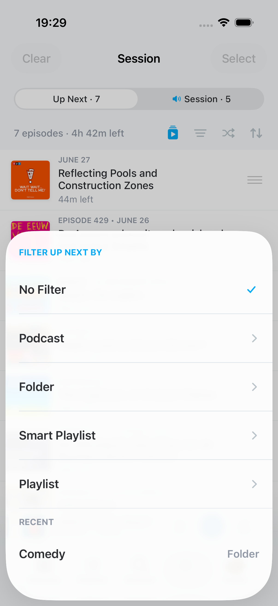

<p align="center">
    <!-- Pocket Casts brand image -->
    
    
</p>

<p align="center">
    <!-- Badge: "build: {trunk CI status}" -->
    <a href="https://buildkite.com/automattic/pocket-casts-ios"></a>
    <!-- Badge: "license: MPL" -->
    <a href="https://github.com/Automattic/pocket-casts-ios/blob/trunk/LICENSE.md"></a>
    <!-- Badge: "platform: ios|watchos" -->
    
    <!-- Badge: "Xcode: {version}+" -->
    
</p>

<p align="center">
    Pocket Casts is the world's most powerful podcast platform, an app by listeners, for listeners.
</p>

# 🍴 About this fork

A personal fork by [@mdbraber](https://github.com/mdbraber) adding a set of playback-workflow features on the `feature/upnext-filter` branch. All additions are device-local — fork-only database columns are kept outside the upstream schema chain and never sync to the official servers.

<table>
  <tr>
    <td align="center"><br /><sub>Play as Session</sub></td>
    <td align="center"><br /><sub>Session / Up Next pills</sub></td>
    <td align="center"><br /><sub>Queue lens + recents</sub></td>
    <td align="center"><br /><sub>Smart rules</sub></td>
  </tr>
</table>

### Playback Sessions

- **Play as Session**: a playlist (manual or smart) or a podcast plays *instead of* the Up Next queue. The queue is never modified; when the session runs out of unfinished episodes, playback returns to it. A podcast's *Play as Session* runs through a one-podcast smart playlist (created on first use), so podcast sessions get the Inbox, custom order, and reorder/sort like any other session. The session is a **live mirror** of its playlist: reorder in either place and both change.
- The Up Next screen has a sticky **pill switcher** (Up Next left, Session right): each pill carries its world's episode count, and the playing world is marked with a speaker glyph. Each world shows a centered title, the Now Playing card (only where playback lives), a counts line covering what's still to come (filtered counts when a queue lens is active), and the list. The pill **auto-follows** playback ownership; tapping the other pill is a view-only *peek* that never changes what plays. The tab bar button and screen title name the playing world, and activating the tab lands on it.
- The **Switch sheet** (nav-bar *Switch*, a long-press on the Session pill or the tab bar button, or the empty state's *Choose session*) lists Up Next, the three most recent queue filters, and every playlist — styled like the Playlists screen. Every choice starts playback; picking *Up Next* ends the session and returns to the queue.
- Session rows behave like queue rows: tap per the "Play Up Next On Tap" setting, drag-to-reorder (mirroring the playlist), move to top/bottom and add-to-queue swipes, mark played, and multi-select with session-appropriate actions (*Select* applies to the shown world). Switching episodes moves the interrupted one to the top in both worlds. The sort picker mirrors the playlist's options without restarting playback.

### Smart Playlist Custom Order (Inbox + Lineup)

- Smart playlists support **drag-and-drop custom order** as an overlay: the smart rules keep deciding *membership*, stored positions decide *order*. Positions survive sort switches, sync rebuilds, and full syncs.
- The playlist page shows **Inbox | Lineup tabs** (styled like the podcast page's tabs, each with its own counts line) — new arrivals wait in the Inbox until triaged via swipe, drag, or *Add all new episodes to Lineup*. Opening lands on the Inbox when it has episodes. A per-playlist setting auto-adds arrivals instead (at **Top / Bottom / After Last Added / Before Last Added**) and hides the tabs entirely.
- Sessions play the **Lineup only**; untriaged episodes are surfaced via a tappable inbox line under the session title. Playing a playlist whose Lineup is empty asks: *Add all to Lineup & Play* or *Play as-is*.
- Single-podcast smart playlists get a **Show/Hide Archived** toggle, on any sort order.

### Up Next Queue Lens

- Filter the queue by **podcast, folder, smart playlist, or manual playlist**: non-matching episodes dim and auto-advance skips them — the queue itself is never trimmed or reordered. The counts line reflects what will actually play.
- A compact view (eye) hides skipped episodes; the filter picker offers the five most recently used filters, and the Switch sheet surfaces the last three as one-tap shortcuts.

### Folder-Linked Playlists

- A smart playlist can **track folders**: pick folders inside the Choose Podcasts rule (All / folders / individual podcasts) and the folders' podcasts are materialized into the standard, synced podcast rule — kept up to date as folder membership changes on any device.
- Other devices (web, Android, stock iOS) simply see an ordinary podcast-filtered playlist via normal Pocket Casts sync; only this fork maintains the link.

Everything is gated behind the `upNextFilter` and `playbackSessions` feature flags and built for personal use. The upstream README follows.

## Setup

If you don't already have it, you need to install Bundler:

`gem install bundler`

Next you'll need to install all the dependencies needed for [_fastlane_](https://docs.fastlane.tools/) using this script:

`make install_dependencies`

## External contributors

If you're an external contributor run `make external_contributor`. After that you should be able to build and run the project.

## Swift Formatting

We use [SwiftLint](https://github.com/realm/SwiftLint) to ensure code is spaced and formatted the same way and follows the same [general conventions](https://github.com/Automattic/swiftlint-config). We have a script that will run it over the whole project.

Once the required dependencies are installed via `bundle exec pod install`, you can run:

`make format`

You should do this before making a pull request.

## Running

Open the `.xcodeproj` file, select the Pocket Casts project and the Simulator Device you want to run on, and hit the play button.

## Localization

You can learn more about localization at [docs/Localization.md](./docs/localization.md)

## Protocol Buffers

The app uses [Google Protocol Buffers](https://developers.google.com/protocol-buffers) to define our server objects.

To update server objects you'll need to install the protobuf command line tool as well as the [Swift Protobuf](https://github.com/apple/swift-protobuf) translators. This can be done via Homebrew with:

```
brew install protobuf
brew install swift-protobuf
```

To update the protobuf files you can then run:

Replace the `{API_PATH}` with the full path to the `pocketcasts-api/api/modules/protobuf/src/main/proto` folder

```
make update_proto API_PATH={API_PATH}
```

## Debugging

### Logs

Logs can be found in the app as a view and shared from there through the system sheet or mail:
* Profile > Help & Feedback > ⋯ > Logs

When debugging analytics, the `tracksLogging` feature flag will enable logging for these events.

### Export Files

An export can be created with the database, settings plist, and logs for debugging purposes:
* Profile > Help & Feedback > ⋯ > Export Database - the export will include all log files and settings
* Profile > Settings > Developer > Export Bundle

These exports can also be imported to the app, replacing the database and settings with the ones from the file. This will prompt the user before replacement.
* Open the file with Pocket Casts directly from Files
* Drag and drop the file on the Simulator
* Profile > Settings > Developer > Import Bundle

### Crash Log Symbolication

All [releases](https://github.com/Automattic/pocket-casts-ios/releases) include dSYMs inside of the `xcarchive` file.

These can be used along with the [MacSymbolicator](https://github.com/inket/MacSymbolicator) app to symbolicate any crash logs.
