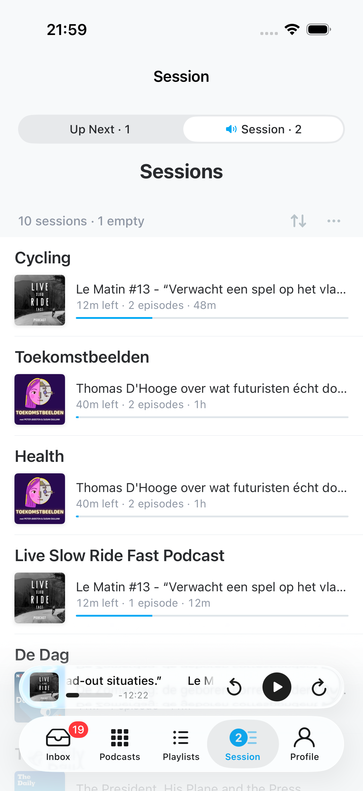
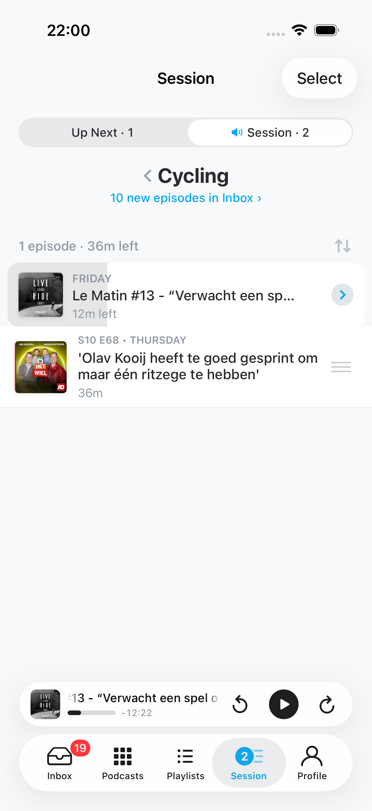
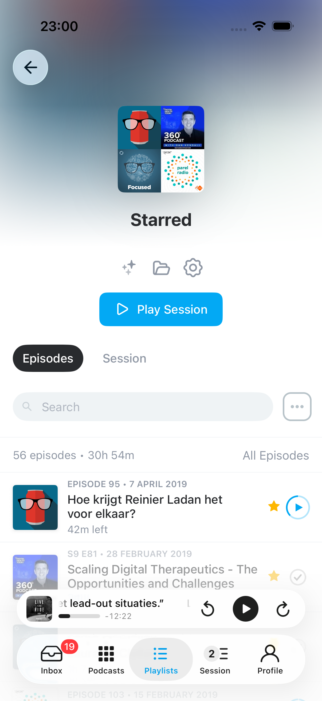
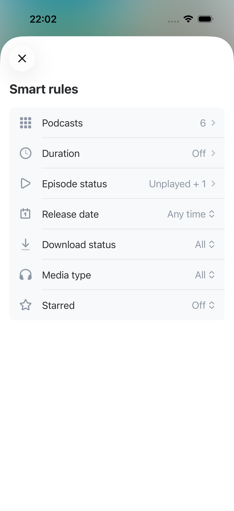

<p align="center">
    <!-- Pocket Casts brand image -->
    
    
</p>

<p align="center">
    <!-- Badge: "build: {trunk CI status}" -->
    <a href="https://buildkite.com/automattic/pocket-casts-ios"></a>
    <!-- Badge: "license: MPL" -->
    <a href="https://github.com/Automattic/pocket-casts-ios/blob/trunk/LICENSE.md"></a>
    <!-- Badge: "platform: ios|watchos" -->
    
    <!-- Badge: "Xcode: {version}+" -->
    
</p>

<p align="center">
    Pocket Casts is the world's most powerful podcast platform, an app by listeners, for listeners.
</p>

# 🍴 About this fork

A personal fork by [@mdbraber](https://github.com/mdbraber) on the `feature/session` branch. It adds a
listening workflow on top of Pocket Casts: episodes arrive in an **Inbox** to be triaged, get shelved into
**Sessions** — curated lineups you play *beside* the Up Next queue — and are found again through named
**Filter Presets**. Fork state that has nowhere to live upstream (session lineups, the seen-ledger,
preferences) syncs privately between the author's own devices via CloudKit or a self-hosted server; nothing
fork-specific is ever sent to Pocket Casts' servers.

<table>
  <tr>
    <td align="center"><br /><sub>Session chooser</sub></td>
    <td align="center"><br /><sub>A session's lineup</sub></td>
    <td align="center"><br /><sub>Playlist as a session</sub></td>
    <td align="center"><br /><sub>Smart rules</sub></td>
  </tr>
</table>

### Inbox

- A tab of its own: every new episode from a subscribed podcast lands here to be triaged. **Membership *is*
  the unseen state**: the Inbox is a synced manual playlist, so there is no separate "seen" column, and the
  unread dot on an episode row anywhere in the app means "still in the Inbox".
- Episodes leave when you decide something: play it, archive it or mark it seen. Adding an episode to a
  session or Up Next keeps it in the Inbox, marked "In Session", "In Up Next" or "In Session & Up Next", and
  gathered in a group at the top (the ⋯ menu's *Group Added Episodes on Top* turns that off). A podcast set to
  *When not in Session or Up Next* takes its episodes out as soon as they are added. A watermark per podcast
  means a fresh install or a full sync never floods the Inbox with a backlog.
- The red swipe removes an episode from every session and from Up Next, asking which when it is in both;
  the episode stays in the Inbox either way.
- Decisions are recorded in a **synced seen-ledger**, so an episode you triaged on one device cannot be
  resurrected by another device's older view of the playlist.
- Group by release date, podcast, folder, duration and more, with Reverse Group Order. The *Mark All as Seen*
  pill at the bottom clears the Inbox; a long press offers Archive All.

### Sessions

- A **session** is a lineup you play off to the side of Up Next: one per podcast or smart playlist, and every
  manual playlist is one too. Starting one leaves the queue untouched; when the lineup runs dry, playback
  returns to it. Only subscribed podcasts get sessions.
- The Queue tab lists **Up Next** first, then the current session, then the rest of your sessions. Each row
  shows the episode it would actually play next, its duration and progress. Tapping a row opens its lineup;
  nothing plays until you press play. Search, swipe to remove or move to top/bottom, and drag to reorder.
- The session list's ⋯ menu offers **Sort By** (Manual, Last Played, Recently Updated, Name, Time Left) and
  **Group By** (Session Type or Last Played, with Reverse Group Order). Both stick and sync; Manual brings
  back your own order, and dragging a session on a sorted list makes it Manual with a toast saying so. The
  same menu hides empty sessions, an empty Up Next, and podcast sessions a smart playlist already covers.
- A session's lineup has **Episodes | Session** tabs when something feeds it (a podcast or smart playlist):
  Episodes browses the source with search, presets and grouping, and adds or removes episodes; Session is the
  lineup itself. A lineup has one saved play order: Sort By (or Manual) and Group By are saved on the session,
  synced, and decide what plays next. The same tabs appear on playlist and podcast pages.
- **Play Session** (on playlist and podcast pages) opens the session in the Queue tab; a long press queues it
  without playing.
- Episodes you add by hand are **pinned**: the reconciler may prune what it gathered, but never what you
  put there. Smart-playlist sessions can be set to **Fill Session: Automatic** (mirrors the playlist) or
  **Manual** (hand-curated), and any smart playlist can opt out of being a session entirely.
- **Episodes per Session** (per podcast) keeps only a podcast's newest N episodes in every session. Older
  ones leave the session without being archived; hand-added and started episodes are kept.

### Filter Presets

- Named, reorderable, synced filters: status, list membership (including *Not in Session*), playing and
  download state, media type, release window, duration, podcast/folder scope, plus the sort and grouping to
  apply. One labelled control on every episode list replaces the stock funnel; a session's lineup can be
  narrowed by a preset without changing what plays.

### Sync

- Fork state syncs through iCloud by default. Settings → Synchronization can switch it to the self-hosted
  **Pocket Casts Sessions server** ([`../server/`](../server/)): enter its URL and the app enrolls through your
  Pocket Casts account. With the server, devices get pushes for new episodes and changes, **Follow Now
  Playing** lets an idle device pick up the session another device is playing, and Pocket Casts' own sync can
  optionally be routed through the server.
- Per-podcast settings (speed, effects, skips) sync both ways through the Pocket Casts account, and archive
  and mark-as-played are sent straight away instead of waiting for the next refresh.

### Video and chapters

- Video episodes get chapters, with the chapter title, position and previous/next in the video player, and
  the episode screen lists any episode's chapters without playing it.
- A captions menu in the video player chooses the video's own caption track or the episode transcript.
- Pocket Casts' generated chapter titles are translated on-device into the podcast's language (a General
  setting, on by default).
- Episodes from the author's own OwnTube feeds stream as HLS and load their chapters from the feed host.

### Everywhere else

- **Swipes** speak one vocabulary: left is *Add to Session* and *Add to…* (Up Next top/bottom, or a
  playlist), with *Move to top* / *Move to bottom* added in queue contexts. Right keeps the stock
  remove/archive verbs.
- **Pocket Casts web links** open in the app: from Safari (a Safari extension), from the Share sheet (links
  and podcast feed URLs), and through `pktc://weblink` and `pktc://podcast`.
- **Playlist folders** group playlists the way podcast folders group podcasts. Podcast pages have a
  **Playlists** tab listing the playlists that hold that podcast's episodes.
- **Badges** can count Inbox or session membership, on podcasts, playlists and the app icon; the Queue tab
  shows 99+ past 99.
- **CarPlay** puts Up Next and every session on one tab, ordered by recency; tapping a session opens it.
- **Home-screen quick actions** lead with whichever of Up Next or the session is playing.
- A long press on *Mark as Played* on an episode page offers *Mark as Unplayed*.
- **Per-podcast settings** are grouped as Inbox → Up Next → Session, with linking overrides on their own page.

Built for personal use, so the fork favours a coherent workflow over configurability. The upstream README
follows.

## Setup

If you don't already have it, you need to install Bundler:

`gem install bundler`

Next you'll need to install all the dependencies needed for [_fastlane_](https://docs.fastlane.tools/) using this script:

`make install_dependencies`

## External contributors

If you're an external contributor run `make external_contributor`. After that you should be able to build and run the project.

## Swift Formatting

We use [SwiftLint](https://github.com/realm/SwiftLint) to ensure code is spaced and formatted the same way and follows the same [general conventions](https://github.com/Automattic/swiftlint-config). We have a script that will run it over the whole project.

Once the required dependencies are installed via `bundle exec pod install`, you can run:

`make format`

You should do this before making a pull request.

## Running

Open the `.xcodeproj` file, select the Pocket Casts project and the Simulator Device you want to run on, and hit the play button.

## Localization

You can learn more about localization at [docs/Localization.md](./docs/localization.md)

## Protocol Buffers

The app uses [Google Protocol Buffers](https://developers.google.com/protocol-buffers) to define our server objects.

To update server objects you'll need to install the protobuf command line tool as well as the [Swift Protobuf](https://github.com/apple/swift-protobuf) translators. This can be done via Homebrew with:

```
brew install protobuf
brew install swift-protobuf
```

To update the protobuf files you can then run:

Replace the `{API_PATH}` with the full path to the `pocketcasts-api/api/modules/protobuf/src/main/proto` folder

```
make update_proto API_PATH={API_PATH}
```

## Debugging

### Logs

Logs can be found in the app as a view and shared from there through the system sheet or mail:
* Profile > Help & Feedback > ⋯ > Logs

When debugging analytics, the `tracksLogging` feature flag will enable logging for these events.

### Export Files

An export can be created with the database, settings plist, and logs for debugging purposes:
* Profile > Help & Feedback > ⋯ > Export Database - the export will include all log files and settings
* Profile > Settings > Developer > Export Bundle

These exports can also be imported to the app, replacing the database and settings with the ones from the file. This will prompt the user before replacement.
* Open the file with Pocket Casts directly from Files
* Drag and drop the file on the Simulator
* Profile > Settings > Developer > Import Bundle

### Crash Log Symbolication

All [releases](https://github.com/Automattic/pocket-casts-ios/releases) include dSYMs inside of the `xcarchive` file.

These can be used along with the [MacSymbolicator](https://github.com/inket/MacSymbolicator) app to symbolicate any crash logs.
